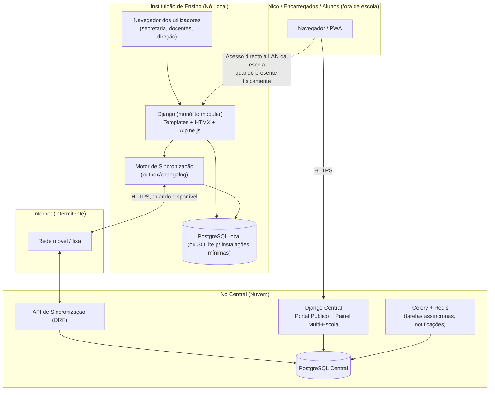
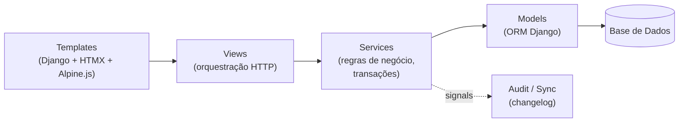
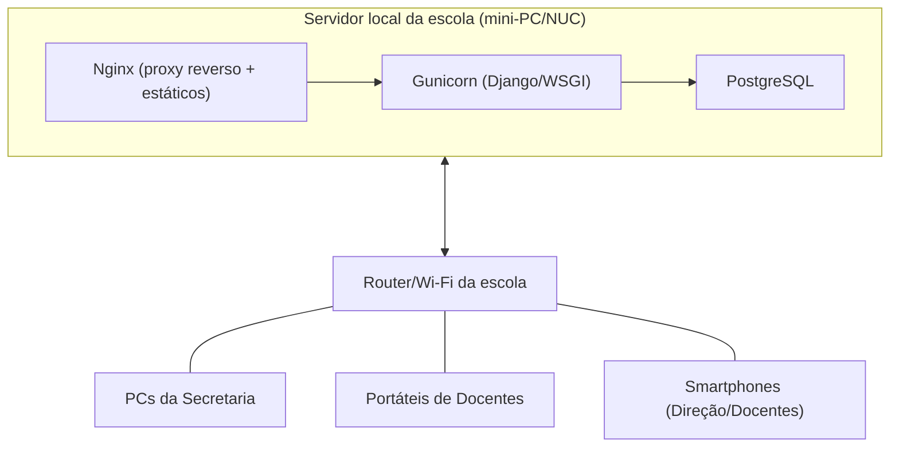

# 04. Arquitetura Técnica

## 4.1 Visão geral

FenixSchool adopta uma arquitetura de **"Nó Local" + "Nó Central"**, ambos executando o
**mesmo código Django**, diferenciados apenas por configuração (`settings`/variáveis de
ambiente) e pelo papel que desempenham na topologia de sincronização.



**Ideia central**: a escola nunca depende do nó central para operar. O nó central existe
para (a) agregar dados de múltiplas escolas, (b) servir o portal público/institucional
acessível fora da rede da escola, (c) fazer backup externo, e (d) permitir gestão de rede
(múltiplas instituições) a partir de um único ponto.

## 4.2 Estilo arquitetural: monólito modular Django

Decisão deliberada: **não** usar microserviços nem SPA externa. Razões:
- Menor superfície operacional para equipas técnicas pequenas/únicas nas escolas.
- Facilidade de implantação num único servidor local.
- Django Admin + Templates cobrem a maior parte das necessidades de CRUD administrativo
  sem esforço de duplicação de camada de API/UI.
- HTMX + Alpine.js entregam interatividade (atualizações parciais de página, modais,
  validação client-side leve) sem exigir um bundler/SPA, mantendo o "frontend integrado".

O monólito é dividido em **apps Django coesas**, cada uma com os seus modelos, views,
templates, forms e regras de negócio (`services.py`), comunicando entre si por imports
directos (mesmo processo) e Django signals para desacoplamento pontual.

### 4.2.1 Mapa de apps

| App | Responsabilidade |
|---|---|
| `core` | Modelos-base (mixins de auditoria, UUID, soft-delete, sync), configuração da Instituição, Ano/Período/Ciclo Lectivo, feriados |
| `accounts` | Utilizador customizado, Perfis/Grupos, autenticação, 2FA, permissões |
| `academic` | Departamento, Curso, Disciplina, Ano Curricular, Turma, Sala, Horário |
| `enrollment` | Aluno, Candidato, Encarregado de Educação, Inscrição, Matrícula, Documento |
| `grading` | Tipos de Avaliação, Nota, Fórmulas de Média, Pauta, Boletim, Situação Final |
| `attendance` | Presença/Falta, Justificação, Mapa de Assiduidade |
| `finance` | Tabela de Preços, Plano de Mensalidades, Pagamento, Recibo, Desconto/Bolsa |
| `hr` | Funcionário, Cargo, Secção/Departamento Funcional, Contrato |
| `communications` | Aviso/Notícia, Notificação (SMS/email/portal), Fila de envio |
| `reports` | Geração de Declarações, Certificados, Pautas oficiais, Relatórios estatísticos |
| `public_site` | Views/templates do portal público institucional |
| `student_portal` | Views/templates do portal do aluno |
| `guardian_portal` | Views/templates do portal do encarregado de educação |
| `admin_panel` | Área administrativa restrita (config., auditoria, painel de sync) |
| `sync` | Motor de sincronização (changelog, outbox, resolução de conflitos) |
| `api` | Django REST Framework — endpoints de sincronização e, no futuro, apps móveis |
| `audit` | Registo de auditoria transversal (usado por todas as apps via mixin/signal) |

Cada app segue a estrutura padrão Django (`models.py`/`models/`, `views.py`, `forms.py`,
`services.py`, `templates/<app>/`, `tests/`). Ver estrutura de directórios completa em
[10-stack-tecnologica-e-estrutura-projeto.md](10-stack-tecnologica-e-estrutura-projeto.md).

## 4.3 Camadas dentro de cada app



- **Views** ficam finas: validam entrada (Forms), chamam **services**, devolvem resposta
  (página completa ou fragmento HTMX).
- **Services** concentram lógica de negócio (ex.: `matricular_aluno()`,
  `lancar_nota()`, `fechar_pauta()`, `registar_pagamento()`), sempre dentro de
  `transaction.atomic()`, garantindo consistência mesmo com escrita simultânea offline.
- **Models** finos, com validações de integridade (`clean()`, constraints de BD).
- Qualquer `save()`/`delete()` relevante dispara um **signal** que grava uma entrada no
  **changelog de sincronização** e no **log de auditoria** — nunca lógica de sync dentro
  dos próprios models de domínio (separação de responsabilidades).

## 4.4 Multi-tenancy e isolamento de dados

Com múltiplas escolas a operar no mesmo Nó Central (e, no futuro, a possibilidade de um
Nó Local também hospedar mais de uma instituição — ex. dois estabelecimentos do mesmo
grupo educativo partilhando o mesmo servidor físico), o modelo de **multi-tenancy por
coluna** é adoptado de forma uniforme em **toda a stack** (Nó Local e Nó Central correm o
mesmo código):

- Toda tabela de negócio tem FK obrigatória `instituicao_id` (herdada do mixin
  `SyncedModel`, ver [05-modelo-de-dados.md](05-modelo-de-dados.md)).
- Isolamento reforçado por *managers* Django (`TenantQuerySet`) que filtram
  automaticamente por `instituicao_id` do contexto corrente, e opcionalmente por
  PostgreSQL Row-Level Security como camada adicional de defesa em profundidade no Nó
  Central (onde o risco de fuga entre tenants tem maior impacto).
- Alternativa avaliada e **rejeitada**: schema-per-tenant (`django-tenants`) — maior
  complexidade operacional sem benefício claro face ao FK-based tenancy, que já é
  suficiente mesmo para centenas de instituições.

### 4.4.1 O utilizador nunca escolhe a escola — o sistema resolve-a sozinho

Requisito central de usabilidade: **ninguém, em momento algum do fluxo normal, selecciona
manualmente a instituição a que pertence**. A instituição é resolvida automaticamente a
partir de quem está autenticado, tanto no cadastro de novos utilizadores como no filtro
de dados apresentados.

**Modelo de dados de suporte** (`accounts.Utilizador`):

| Campo | Regra |
|---|---|
| `instituicao_id` | FK obrigatória (excepto para `Super Administrador`, o único perfil sem instituição fixa — ver abaixo) — **definida uma única vez, no momento da criação da conta, e nunca editável depois** por um formulário normal (só por acção deliberada de Super Administrador, ex. correção de erro) |
| `criado_por_id` | FK ao utilizador que efectuou o cadastro (rastreabilidade da cadeia de onboarding) |

**Regra de propagação automática de tenant** (implementada como comportamento do
`service` de criação de utilizador/funcionário, não como lógica espalhada pelas views):

```python
# accounts/services.py (pseudo-código ilustrativo da regra, não código final)
def criar_utilizador(dados, criado_por: Utilizador) -> Utilizador:
    if criado_por.perfil == Perfil.SUPER_ADMINISTRADOR:
        # único caso em que a instituição é escolhida explicitamente no formulário
        instituicao = dados["instituicao"]
    else:
        # todos os outros perfis: herdam SEMPRE a instituição de quem os está a criar
        instituicao = criado_por.instituicao

    return Utilizador.objects.create(
        instituicao=instituicao,
        criado_por=criado_por,
        **dados_sem_instituicao(dados),
    )
```

Isto cobre exactamente o cenário descrito: quando o **Gestor da Instituição** (perfil
`Administrador da Instituição`) é criado — normalmente pelo próprio processo de
onboarding da escola (ver 4.4.2) — fica associado à sua escola. A partir daí, **qualquer
funcionário que ele cadastre (Secretaria, Docente, Financeiro, RH, Direção Pedagógica,
etc.) herda automaticamente essa mesma instituição**, sem qualquer campo "Escola" visível
no formulário de cadastro de funcionários. O mesmo se aplica, em cascata, caso esse
funcionário venha a cadastrar outros (ex. Secretaria a registar um Encarregado de
Educação, que herda a instituição do aluno/matrícula em vez de a de quem regista — ver
excepção 4.4.3).

### 4.4.2 Onboarding de uma nova instituição

Fluxo único (não repetido) que cria a instituição **e** o seu primeiro utilizador
(Gestor) na mesma transação, para nunca existir uma instituição "órfã" sem responsável:

```mermaid
sequenceDiagram
    participant SA as Super Administrador (ou fluxo de auto-registo assistido)
    participant S as Sistema (accounts + core)

    SA->>S: Regista Instituição (dados) + Gestor (dados da conta)
    S->>S: BEGIN TRANSACTION
    S->>S: Cria Instituicao (core.Instituicao)
    S->>S: Cria Utilizador Gestor com instituicao_id = instituição recém-criada, perfil = Administrador da Instituição
    S->>S: COMMIT
    S-->>SA: Instituição activa; Gestor recebe credenciais/convite de acesso
    Note over S: A partir daqui, o Gestor cadastra os<br/>restantes funcionários — todos herdam<br/>automaticamente esta instituição
```

Este passo é o **único ponto do sistema** em que uma instituição é explicitamente
seleccionada/criada para um utilizador. No Nó Local de uma escola isto acontece uma única
vez, na instalação inicial (setup wizard, ver
[11-implantacao-e-operacoes.md](11-implantacao-e-operacoes.md)). No Nó Central, se vier a
suportar auto-registo de novas escolas na rede, o mesmo fluxo aplica-se, apenas acionado
por um formulário público de "Registar a minha escola" em vez de uma acção interna do
Super Administrador.

### 4.4.3 Excepção controlada: Encarregado de Educação

O Encarregado de Educação é o único stakeholder que **não é cadastrado por si próprio**
nem herda instituição de "quem o cria" no sentido literal — ele é criado pela Secretaria
no acto de Inscrição do aluno, e a sua `instituicao_id` é herdada da **instituição do
aluno/matrícula em curso**, não da instituição do funcionário da Secretaria (que, na
prática, coincidem sempre, pois cada funcionário só actua dentro da sua própria
instituição — ver 4.4.4). Caso o mesmo encarregado tenha educandos em mais do que uma
instituição da mesma rede (irmãos em escolas diferentes do grupo), o sistema cria contas
de acesso logicamente distintas por instituição, ligadas ao mesmo documento de
identificação, para preservar o isolamento de tenant — o portal apresenta um selector de
"perfil por instituição" apenas neste caso específico e raro (nunca no caso comum de um
funcionário/aluno normal).

### 4.4.4 Aplicação da regra de isolamento em tempo de execução

- **Middleware de contexto de tenant** (`core.middleware.TenantMiddleware`): a cada
  pedido autenticado, resolve `request.instituicao = request.user.instituicao` (excepto
  Super Administrador, que opera num contexto explícito de "instituição seleccionada
  para visualização", nunca ambíguo) e disponibiliza esse valor a todos os `services` e
  `QuerySets` da chamada.
- **Managers com filtragem automática**: `Modelo.objects` (tenant-aware) filtra sempre
  por `instituicao_id = request.instituicao_id` por omissão; um acesso "sem filtro" exige
  uso explícito de `Modelo.all_objects` (nome deliberadamente incómodo de invocar),
  reservado a tarefas de sistema (sincronização, Super Administrador).
- **Login sem selecção de escola**: o formulário de autenticação pede apenas
  email/telefone + password (+ 2FA quando aplicável). Nunca existe um campo ou dropdown
  "escola" no ecrã de login — a instituição do utilizador já está gravada na sua conta
  desde a criação (4.4.1), e é isso que determina o que ele vê a seguir.
- **Garantia de defesa em profundidade**: mesmo que uma view esqueça de aplicar o filtro
  (erro de programação), o Row-Level Security do PostgreSQL no Nó Central impede
  fisicamente que uma sessão autenticada como pertencente à Instituição A leia linhas da
  Instituição B.

## 4.5 Identificadores e modelo de dados distribuído

Requisito estrutural para permitir fusão de dados vindos de múltiplos nós locais no nó
central sem colisão:

- **UUID v7** (ordenável por tempo) como chave primária em todas as entidades de negócio
  (não `AutoField` incremental), gerado no nó de origem (local ou central).
- Cada registo carrega: `origin_node_id` (identifica o nó local/instituição onde nasceu),
  `created_at`, `updated_at`, `updated_by`, `version` (contador optimista de concorrência),
  `is_deleted` (soft-delete — nunca eliminação física de dados académicos/financeiros).
- Números "humanos" (n.º de aluno, n.º de matrícula, n.º de recibo) continuam a existir
  como **campos sequenciais por instituição**, gerados localmente e imutáveis, distintos
  da chave primária técnica (UUID). Isto resolve o conflito entre "sequencial legível
  para o utilizador" e "identificador globalmente único para sincronização".

Detalhe completo do motor de sincronização, incluindo resolução de conflitos, em
[08-offline-first-e-sincronizacao.md](08-offline-first-e-sincronizacao.md).

## 4.6 Frontend integrado (sem SPA)

| Camada | Tecnologia | Papel |
|---|---|---|
| Templates | Django Template Language | Renderização server-side de páginas completas |
| Interatividade parcial | HTMX | Submissão de formulários e actualização de fragmentos de página sem recarregar tudo (ex.: pesquisa de aluno, modais de matrícula, lançamento de notas em grelha) |
| Micro-interações client-side | Alpine.js | Toggle de menus, validação inline, contadores, sem necessidade de build step |
| Estilo | Bootstrap 5 (customizado) | Grelha responsiva, componentes acessíveis, consistência visual |
| Gráficos/relatórios visuais | Chart.js (carregado localmente, não via CDN externo) | Painéis de Direção (taxa de aprovação, inadimplência) |
| PWA (portais externos) | Service Worker + Web App Manifest | Cache de leitura offline para aluno/encarregado, fila de submissões (Background Sync API) quando o dispositivo está sem rede |

Esta escolha cumpre explicitamente o requisito "Django com frontend integrado, sem
React/Vue": toda a lógica de apresentação vive em templates Django versionados com o
resto do código, sem processo de build de frontend nem API JSON obrigatória para a
navegação normal (a API DRF existe apenas para sincronização e futura integração móvel).

## 4.7 Processamento assíncrono

- **Nó Central**: Celery + Redis para tarefas como envio de notificações em massa,
  geração de relatórios pesados, processamento de lotes de sincronização.
- **Nó Local**: para manter a instalação simples (evitar depender de Redis num servidor
  modesto e por vezes intermitente energicamente), usa-se **Django-Q2 com backend em
  base de dados** (sem Redis) para tarefas locais (geração de PDF em lote, envio de fila
  de notificações quando há rede). Isto reduz o número de serviços a manter no nó local
  para: Postgres + Django (Gunicorn) — nada mais é estritamente obrigatório.

## 4.8 Integrações externas (todas opcionais e degradam graciosamente)

| Integração | Uso | Comportamento sem conectividade |
|---|---|---|
| Gateway SMS (Unitel/Movicel/Africell, via agregador) | Notificações a encarregados | Mensagens ficam em fila local, enviadas quando há rede |
| Email (SMTP) | Notificações, recuperação de password | Idem — fila local |
| Multicaixa Express / TPA (futuro) | Registo/confirmação de pagamentos | Pagamento pode sempre ser registado manualmente pela tesouraria; integração é um atalho, não uma dependência |
| Exportação MED | Relatórios normativos | Geração local a qualquer momento, envio manual ou automatizado quando existir API oficial |

## 4.9 Decisões de arquitetura registadas (ADR resumidas)

| # | Decisão | Alternativas consideradas | Razão da escolha |
|---|---|---|---|
| ADR-01 | Monólito modular Django, frontend server-side (HTMX/Alpine) | SPA (React/Vue) + API REST separada | Requisito explícito do cliente; menor complexidade operacional; equipa/escolas sem recursos para manter duas bases de código |
| ADR-02 | Nó Local obrigatório por escola + Nó Central para agregação | SaaS 100% centralizado | Realidade de conectividade angolana torna inviável depender de nuvem para operação diária |
| ADR-03 | UUID v7 como PK de domínio | Auto-increment + tabela de mapeamento | Simplicidade de fusão de dados multi-nó sem passo de reconciliação de IDs |
| ADR-04 | PostgreSQL como motor preferencial local e central (SQLite como opção mínima) | SQLite único, MySQL | PostgreSQL oferece melhores garantias de concorrência e replicação futura; SQLite mantido como via de entrada para escolas muito pequenas com hardware mínimo |
| ADR-05 | Celery/Redis só no nó central; Django-Q (DB-backed) no nó local | Celery/Redis em todo o lado | Reduzir serviços a operar no servidor da escola |
| ADR-06 | Soft-delete universal em dados de negócio | Delete físico | Auditabilidade legal e histórico escolar nunca podem desaparecer |

## 4.10 Vista de implantação de referência (uma escola)



Detalhes de dimensionamento de hardware, backups e operação em
[11-implantacao-e-operacoes.md](11-implantacao-e-operacoes.md).
