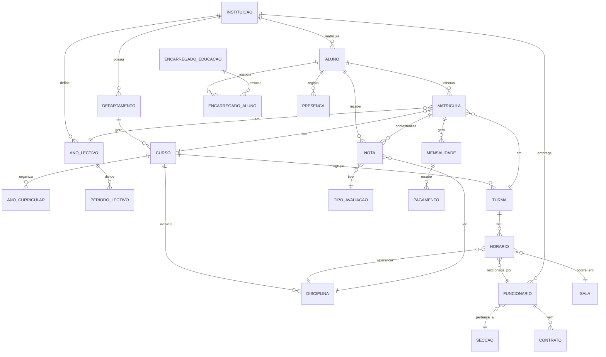

# 05. Modelo de Dados

Este modelo expande as tabelas originais do documento `fenixschoolEM.pdf` (Instituição,
Departamento, Curso, Disciplina, Turma, Horário, Matrícula, Nota, Mensalidade), preservando
os conceitos de negócio validados, e adiciona as entidades necessárias para cobrir o
escopo completo (utilizadores/perfis, frequência, RH, comunicação, auditoria e
sincronização).

Convenções transversais (aplicadas a **todas** as entidades de negócio via mixin
`SyncedModel` em `core`):

| Campo comum | Tipo | Descrição |
|---|---|---|
| `id` | UUID v7 | Chave primária, gerada na origem |
| `instituicao_id` | UUID (FK) | Instituição proprietária do registo |
| `origin_node_id` | UUID | Nó (local/central) onde o registo nasceu |
| `created_at` / `updated_at` | datetime | Auditoria temporal |
| `updated_by_id` | FK Utilizador | Quem fez a última alteração |
| `version` | inteiro | Controlo de concorrência optimista |
| `is_deleted` | boolean | Soft-delete (nunca eliminação física) |

## 5.1 Diagrama de entidades (visão geral)

## 5.2 Entidade: Instituição (`core.Instituicao`)

Expande a tabela original (`Nome, Casa, Rua, Bairro, Telefone Fixo, Telefone Unitel,
Telefone Movicel, Email, home, logotipo, urllogotipo`):

| Campo | Tipo | Obs. |
|---|---|---|
| nome | texto | Nome oficial da instituição |
| nif | texto | Número de Identificação Fiscal |
| codigo_med | texto | Código atribuído pelo Ministério da Educação |
| provincia | choice | Lista das 18 províncias de Angola |
| municipio | choice | Dependente da província |
| distrito_comuna | texto | |
| bairro | texto | |
| rua | texto | |
| numero_casa | texto | (equivalente ao antigo campo `Casa`) |
| telefone_fixo | texto | |
| telefone_unitel | texto | |
| telefone_movicel | texto | |
| telefone_africell | texto | *(novo — operadora surgida após 2017)* |
| email | texto | |
| website | texto | (equivalente ao antigo `home`) |
| logotipo | ficheiro (imagem) | Substitui o campo binário original |
| ano_lectivo_corrente_id | FK AnoLectivo | |
| formula_media_default | JSON | Fórmula por omissão de cálculo de médias (pode ser sobreposta por curso/disciplina) |
| bloqueia_documentos_com_divida | booleano | Parametrização financeira (RF-FIN-06) |

## 5.3 Entidade: Ano Lectivo / Período Lectivo / Ciclo Lectivo (`core`)

| Entidade | Campos principais |
|---|---|
| **AnoLectivo** | `designacao` (ex. "2026/2027"), `data_inicio`, `data_fim`, `is_corrente` |
| **PeriodoLectivo** | `ano_lectivo`, `numero` (1.º/2.º/3.º Trimestre), `data_inicio`, `data_fim` |
| **CicloLectivo** | `designacao` (ex. "1.º Ciclo", "2.º Ciclo"), `ordem` |
| **DiaNaoLectivo** | `data`, `descricao`, `abrangencia` (nacional/provincial/institucional) |

## 5.4 Entidade: Departamento (`academic.Departamento`)

Igual ao original, com adição de responsável:

| Campo | Tipo | Obs. |
|---|---|---|
| nome | texto | |
| responsavel_id | FK Funcionario | Chefe de Departamento |

## 5.5 Entidade: Curso (`academic.Curso`)

| Campo | Tipo | Obs. |
|---|---|---|
| codigo | texto | |
| nome | texto | |
| abreviatura | texto | |
| data_criacao | data | |
| departamento_id | FK Departamento | |
| codigo_med | texto | Código atribuído pelo MED (equivalente ao original) |
| ciclo_id | FK CicloLectivo | Novo — a que ciclo pertence o curso |
| duracao_anos | inteiro | Ex.: 4 anos (10.ª a 13.ª classe) |

## 5.6 Entidade: Disciplina (`academic.Disciplina`)

| Campo | Tipo | Obs. |
|---|---|---|
| codigo | texto | |
| nome | texto | |
| abreviatura | texto | |
| data_criacao | data | |
| curso_id | FK Curso | |
| ano_curricular_id | FK AnoCurricular | Ex. "Primeiro Ano" |
| periodo_id | FK PeriodoLectivo | Ex. "2.º Trimestre" (quando a disciplina é semestral/trimestral) |
| ciclo_id | FK CicloLectivo | Ex. "1.º Ciclo" |
| tipo_disciplina | choice | Obrigatória / Opcional / Extracurricular |
| carga_horaria_semanal | inteiro | Novo — horas/semana |

## 5.7 Entidade: Ano Curricular (`academic.AnoCurricular`) — *nova*

Separação explícita entre "ano do curso" (1.º, 2.º, 3.º, 4.º ano curricular) e "classe"
administrativa (10.ª, 11.ª, 12.ª, 13.ª), pois um aluno repetente pode estar na mesma
classe em anos lectivos diferentes:

| Campo | Tipo | Obs. |
|---|---|---|
| curso_id | FK Curso | |
| numero | inteiro | 1, 2, 3, 4 |
| classe_equivalente | texto | Ex. "10.ª classe" |

## 5.8 Entidade: Turma (`academic.Turma`)

| Campo | Tipo | Obs. |
|---|---|---|
| codigo | texto | |
| designacao | texto | |
| ano_lectivo_id | FK AnoLectivo | |
| periodo_lectivo_id | FK PeriodoLectivo | |
| curso_id | FK Curso | *(novo — o original só tinha via matrícula)* |
| ano_curricular_id | FK AnoCurricular | *(novo)* |
| numero_maximo_inscritos | inteiro | |
| director_turma_id | FK Funcionario | *(novo — Diretor de Turma, figura comum em Angola)* |
| turno | choice | Manhã / Tarde / Noite *(novo)* |

## 5.9 Entidade: Sala (`academic.Sala`) — *nova*

| Campo | Tipo |
|---|---|
| designacao | texto |
| capacidade | inteiro |

## 5.10 Entidade: Horário (`academic.Horario`)

| Campo | Tipo | Obs. |
|---|---|---|
| turma_id | FK Turma | |
| disciplina_id | FK Disciplina | |
| dia_semana | choice | Segunda...Sábado |
| hora_inicio | hora | |
| hora_fim | hora | |
| regime | choice | Teórica / Prática / Teórico-Prática |
| sala_id | FK Sala | |
| docente_id | FK Funcionario | |

Regra de negócio (`services.validar_conflito_horario`): impede sobreposição de
docente/sala/turma no mesmo intervalo de tempo.

## 5.11 Entidade: Aluno (`enrollment.Aluno`)

Corresponde ao acto de **Inscrição** (único, perpétuo):

| Campo | Tipo | Obs. |
|---|---|---|
| numero_aluno | inteiro sequencial (por instituição) | Atribuído automaticamente na inscrição |
| nome | texto | |
| sobrenome | texto | |
| data_nascimento | data | |
| genero | choice | Masculino / Feminino |
| foto | imagem | |
| tipo_documento | choice | BI / Cédula Pessoal / Passaporte / Assento de Nascimento |
| numero_documento | texto | Único por instituição (validação anti-duplicação, RF-MAT-03) |
| data_emissao_documento | data | |
| local_emissao_documento | texto | Ex. "Nacional - Luanda" |
| provincia / municipio / distrito / bairro / rua / numero_casa | texto/choice | Endereço |
| profissao | choice | (aplicável se maior/trabalhador-estudante) |
| telefone_movel / telefone_fixo / email | texto | |
| data_inscricao | data | Automática |
| estado | choice | Activo / Transferido / Concluído / Inactivo |

## 5.12 Entidade: Encarregado de Educação (`enrollment.EncarregadoEducacao`) — *nova*

| Campo | Tipo | Obs. |
|---|---|---|
| nome_completo | texto | |
| grau_parentesco | choice | Pai / Mãe / Tutor / Outro |
| tipo_documento / numero_documento | texto | |
| telefone_movel / telefone_fixo / email | texto | |
| profissao | texto | |
| endereco (campos como no aluno) | texto/choice | |
| utilizador_id | FK Utilizador (1-1, opcional) | Conta de acesso ao portal |

## 5.13 Entidade: EncarregadoAluno (`enrollment.EncarregadoAluno`) — *nova, tabela associativa*

| Campo | Tipo | Obs. |
|---|---|---|
| aluno_id | FK Aluno | |
| encarregado_id | FK EncarregadoEducacao | |
| is_principal | booleano | Encarregado principal (financeiro/comunicação) |
| responsavel_financeiro | booleano | |

## 5.14 Entidade: Candidato (`enrollment.Candidato`) — *nova*

Suporta RF-MAT-10 (pré-candidatura antes da inscrição efectiva):

| Campo | Tipo |
|---|---|
| nome_completo | texto |
| data_nascimento | data |
| curso_pretendido_id | FK Curso |
| contacto | texto |
| estado | choice (Pendente/Admitido/Rejeitado) |
| data_candidatura | data |

## 5.15 Entidade: Matrícula (`enrollment.Matricula`)

Corresponde ao acto anual, distinto da Inscrição:

| Campo | Tipo | Obs. |
|---|---|---|
| numero_matricula | inteiro sequencial (por instituição/ano) | |
| data | data | |
| aluno_id | FK Aluno | |
| funcionario_id | FK Funcionario | Quem processou |
| curso_id | FK Curso | |
| ano_lectivo_id | FK AnoLectivo | |
| turma_id | FK Turma | |
| ciclo_lectivo_id | FK CicloLectivo | |
| ano_curricular_id | FK AnoCurricular | |
| estado_matricula | choice | Pendente / Activa / Anulada / Transferida / Concluída |
| tipo_documento_apresentado | choice | |
| numero_documento_apresentado | texto | |
| data_emissao_doc | data | |
| local_emissao_doc | texto | |
| observacoes | texto longo | |
| is_repetente | booleano | *(novo)* |
| matricula_anterior_id | FK Matricula (self, opcional) | Referência à matrícula do ano anterior (histórico/retenção) |

## 5.16 Entidade: Tipo de Avaliação (`grading.TipoAvaliacao`) — *nova*

Parametriza os componentes usados na fórmula de média (RF-INST-06):

| Campo | Tipo | Exemplo |
|---|---|---|
| designacao | texto | "MAC", "Prova Trimestral", "Exame" |
| peso_default | decimal | Peso por omissão na fórmula |

## 5.17 Entidade: Nota (`grading.Nota`)

| Campo | Tipo | Obs. |
|---|---|---|
| aluno_id | FK Aluno | |
| matricula_id | FK Matricula | Contextualiza o ano lectivo/turma |
| disciplina_id | FK Disciplina | |
| curso_id | FK Curso | |
| periodo_lectivo_id | FK PeriodoLectivo | |
| ano_lectivo_id | FK AnoLectivo | |
| ciclo_lectivo_id | FK CicloLectivo | |
| ano_curricular_id | FK AnoCurricular | |
| turma_id | FK Turma | |
| departamento_id | FK Departamento | |
| tipo_avaliacao_id | FK TipoAvaliacao | Ex. Exame, Frequência (mantido do original) |
| classificacao | decimal (0–20) | |
| docente_lancador_id | FK Funcionario | |
| is_pauta_fechada | booleano | Impede edição sem autorização (RF-AVAL-04) |

## 5.18 Entidade: Presença/Falta (`attendance.Presenca`) — *nova*

| Campo | Tipo |
|---|---|
| aluno_id | FK Aluno |
| horario_id | FK Horario |
| data | data |
| estado | choice (Presente/Falta/Falta Justificada) |
| justificacao_texto | texto (opcional) |
| justificacao_anexo | ficheiro (opcional) |
| registado_por_id | FK Funcionario |

## 5.19 Entidade: Mensalidade (`finance.Mensalidade`)

Igual ao original, com pequenos ajustes:

| Campo | Tipo | Obs. |
|---|---|---|
| ano_lectivo_id | FK AnoLectivo | |
| departamento_id | FK Departamento | |
| turma_id | FK Turma | |
| ciclo_lectivo_id | FK CicloLectivo | |
| aluno_id | FK Aluno | |
| curso_id | FK Curso | |
| mes | choice | Janeiro...Dezembro |
| descricao | texto | |
| valor_devido | decimal | *(novo — necessário para calcular saldo)* |
| valor_pago | decimal | |
| valor_juro | decimal | |
| data_vencimento | data | *(novo)* |
| estado | choice | Pendente / Pago / Parcial / Em Atraso |

## 5.20 Entidade: Pagamento (`finance.Pagamento`) — *nova, detalha o "pagamento" separado da mensalidade*

| Campo | Tipo |
|---|---|
| mensalidade_id | FK Mensalidade (opcional — pode ser emolumento avulso) |
| aluno_id | FK Aluno |
| numero_recibo | inteiro sequencial (por instituição) |
| valor | decimal |
| meio_pagamento | choice (Numerário/Transferência/Multicaixa Express) |
| data_pagamento | datetime |
| funcionario_id | FK Funcionario |

## 5.21 Entidade: Funcionário (`hr.Funcionario`)

| Campo | Tipo | Obs. |
|---|---|---|
| nome_completo | texto | |
| tipo_documento / numero_documento | texto | |
| data_nascimento | data | |
| telefone_movel / telefone_fixo / email | texto | |
| seccao_id | FK Seccao | Secretaria / Direção / Financeiro / Pedagógico / RH / Biblioteca / TI / Apoio |
| cargo_id | FK Cargo | |
| utilizador_id | FK Utilizador (1-1) | Conta de acesso ao sistema |
| estado | choice | Activo / Inactivo / Licença / Rescisão |

## 5.22 Entidade: Secção (`hr.Seccao`) e Cargo (`hr.Cargo`) — *novas*

| Entidade | Campos |
|---|---|
| Seccao | `nome` (ex. "Secretaria Escolar", "Direção Pedagógica", "Financeiro/Tesouraria", "Recursos Humanos", "Biblioteca", "TI"), `responsavel_id` |
| Cargo | `designacao` (ex. "Professor", "Secretário(a)", "Tesoureiro(a)", "Director Pedagógico") |

## 5.23 Entidade: Contrato (`hr.Contrato`) — *nova*

| Campo | Tipo |
|---|---|
| funcionario_id | FK Funcionario |
| tipo_vinculo | choice (Efectivo/Contrato a termo/Prestação de serviços) |
| data_inicio / data_fim | data |

## 5.24 Entidade: Utilizador e Perfil (`accounts`)

| Entidade | Campos principais |
|---|---|
| **Utilizador** (`AbstractUser` customizado) | `email` (login), `telefone`, `perfil_id`, `is_2fa_ativo`, `ultimo_acesso`, `idioma_preferido` (choice: `pt` por omissão, `umb`, `kmb`, `kon`, `cjk`, `kua` — preferência pessoal de interface, nunca da instituição; ver [RNF-LOC-06/07](03-requisitos-nao-funcionais.md) e [10-stack-tecnologica-e-estrutura-projeto.md §10.4](10-stack-tecnologica-e-estrutura-projeto.md)) |
| **Perfil/Grupo** | Super Administrador, Administrador da Instituição, Direção Pedagógica, Secretaria, Docente, Diretor de Turma, Financeiro/Tesouraria, RH, Biblioteca, Encarregado de Educação, Aluno, Público (anónimo) |

Detalhe completo da matriz de permissões em
[07-perfis-permissoes-e-fluxos.md](07-perfis-permissoes-e-fluxos.md).

## 5.25 Entidade: Aviso/Comunicado (`communications.Aviso`) e Notificação — *novas*

| Entidade | Campos |
|---|---|
| Aviso | `titulo`, `corpo`, `publico_alvo` (Público/Alunos/Encarregados/Turma específica), `data_publicacao`, `visivel_no_portal_publico` |
| Notificacao | `destinatario_id`, `canal` (SMS/Email/Portal), `estado` (Pendente/Enviado/Falhou), `tentativas`, `payload` |

## 5.26 Entidades de Sincronização (`sync`)

| Entidade | Campos |
|---|---|
| **RegistoAlteracao** (changelog/outbox) | `entidade`, `entidade_id`, `operacao` (create/update/delete), `payload_json`, `origin_node_id`, `criado_em`, `sincronizado_em` |
| **SessaoSincronizacao** | `node_id`, `iniciada_em`, `concluida_em`, `estado`, `registos_enviados`, `registos_recebidos`, `erros` |
| **Conflito** | `entidade`, `entidade_id`, `versao_local_json`, `versao_remota_json`, `estado` (Pendente/ResolvidoAutomaticamente/ResolvidoManualmente), `resolvido_por_id` |
| **Node** | `id` (UUID), `tipo` (Local/Central), `instituicao_id`, `ultimo_sync_em`, `chave_publica` (para autenticação mútua) |

Ver mecanismo completo em
[08-offline-first-e-sincronizacao.md](08-offline-first-e-sincronizacao.md).

## 5.27 Entidades de Auditoria (`audit`)

| Entidade | Campos |
|---|---|
| **RegistoAuditoria** | `utilizador_id`, `acao`, `entidade`, `entidade_id`, `valores_antes_json`, `valores_depois_json`, `ip_origem`, `timestamp` |

## 5.28 Tabelas de referência nacional (fixtures, `core`)

| Tabela | Conteúdo |
|---|---|
| Provincia | 18 províncias de Angola |
| Municipio | Municípios por província |
| OperadoraMovel | Unitel, Movicel, Africell |
| TipoDocumentoIdentificacao | BI, Cédula Pessoal, Passaporte, Assento de Nascimento |
| Profissao | Lista de profissões comuns (CNP simplificada) |
