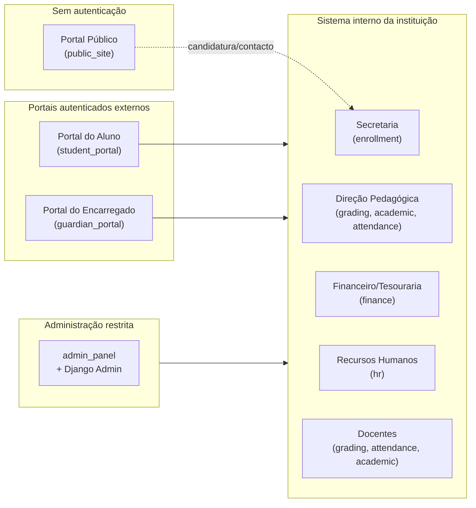

# 06. Módulos e Funcionalidades

Este documento reorganiza o menu do sistema original (`Administração, Currículo,
Funcionários, Inscrições, Tabelas, Área académica, Gestão de Notas, Relatórios, Ajuda,
Tarefas actuais`) num conjunto de módulos modernos, mapeados às apps Django definidas em
[04-arquitetura-tecnica.md](04-arquitetura-tecnica.md), e detalha cada área de acesso do
sistema.

## 6.1 Mapa Menu Original → Módulo Novo

| Menu original (2017) | Módulo/app actual |
|---|---|
| Administração | `admin_panel` |
| Currículo | `academic` |
| Funcionários | `hr` |
| Inscrições (Alunos, Candidatos) | `enrollment` |
| Tabelas | `core` (parametrizações) |
| Área académica | `academic` + `attendance` |
| Gestão de Notas | `grading` |
| Relatórios | `reports` |
| Ajuda | Documentação embutida (ver módulo `help`, opcional) |
| Tarefas actuais | Painel de tarefas pendentes por perfil (dashboard) |

## 6.2 Áreas de acesso (visão de alto nível)

## 6.3 Módulo: Portal Público (`public_site`)

Acessível sem autenticação, tanto no Nó Central (fora da rede da escola) como no Nó Local
(dentro da rede da escola, útil quando não há Internet mas alguém está fisicamente na
instituição):

- Página institucional (apresentação, missão, cursos oferecidos).
- Contactos e localização (mapa estático, morada, telefones por operadora).
- Mural de Comunicados/Notícias (prazos de matrícula, eventos, calendário escolar).
- Formulário de pré-candidatura/contacto (alimenta `enrollment.Candidato`).
- Consulta pública opcional de resultados (por número de aluno, dados minimizados).
- Calendário escolar (ano lectivo, períodos, feriados).

## 6.4 Módulo: Inscrições e Matrículas (`enrollment`)

Reproduz e formaliza o fluxo de exemplo do documento original (Yolene Hangalo):

**Fluxo de Inscrição** (uma única vez na vida do aluno na instituição):
1. Secretaria acede a *Inscrições → Alunos → Novo Aluno*.
2. Preenche dados pessoais, documento de identificação, endereço, contactos.
3. Associa pelo menos um Encarregado de Educação (novo ou existente).
4. Sistema atribui automaticamente o **número de aluno** sequencial.
5. Sistema valida duplicação por número de documento antes de gravar.

**Fluxo de Matrícula** (repetido a cada Ano Lectivo):
1. Secretaria acede a *Inscrições → Matrículas → Nova Matrícula*.
2. Procura o aluno por número de aluno, BI/documento ou nome.
3. Sistema apresenta os dados do aluno pré-carregados e o botão **Matricular**.
4. Secretaria selecciona Curso, Ano Lectivo, Turma, Ciclo Lectivo, Ano Curricular.
5. Sistema valida vaga disponível na turma (RF-MAT-07).
6. Secretaria regista o documento apresentado e observações.
7. **Guardar e Imprimir** grava a matrícula e emite comprovativo em PDF.
8. Sistema gera automaticamente o plano de mensalidades do Ano Lectivo (integração com
   `finance`).

**Funcionalidades adicionais:**
- Gestão de Candidatos (pré-admissão).
- Transferência de aluno (turma/curso/instituição).
- Anulação de matrícula com motivo obrigatório.
- Emissão de declaração de matrícula a qualquer momento.

## 6.5 Módulo: Currículo (`academic`)

- Gestão de Departamentos, Cursos, Disciplinas, Anos Curriculares.
- Gestão de Turmas, Salas e Horários com detecção de conflitos.
- Configuração de Ciclos e Períodos Lectivos (herdado de `core`, gerido aqui na UI
  pedagógica).
- Mapa de ocupação de salas e docentes.

## 6.6 Módulo: Gestão de Notas e Avaliação (`grading`)

- Lançamento de notas por docente (grelha por turma/disciplina/período), com HTMX para
  gravação linha-a-linha sem recarregar a página.
- Cálculo automático da média segundo fórmula parametrizada.
- Fecho de pauta por período (bloqueio de edição, exige perfil Direção Pedagógica para
  reabrir, com auditoria).
- Geração de Pautas e Boletins.
- Cálculo de situação final do aluno no ano lectivo (aprovado/reprovado/disciplinas em
  atraso).
- Histórico escolar consolidado por aluno (todos os anos lectivos).

## 6.7 Módulo: Frequência/Assiduidade (`attendance`)

- Registo de presenças por aula (docente, a partir do horário do dia).
- Justificação de faltas (com anexo opcional).
- Cálculo de percentagem de assiduidade e alerta de risco de reprovação por faltas.
- Mapa de faltas por turma/aluno, exportável.

## 6.8 Módulo: Financeiro (`finance`)

- Configuração de tabelas de preços (propinas, emolumentos, taxas) por ano
  lectivo/curso/classe.
- Geração automática do plano de mensalidades ao matricular.
- Registo de pagamentos com emissão de recibo sequencial em PDF.
- Extracto financeiro por aluno (saldo, histórico).
- Gestão de descontos/bolsas.
- Relatórios de inadimplência e receita (por turma, curso, período).
- Bloqueio configurável de documentos por dívida em aberto.

## 6.9 Módulo: Recursos Humanos (`hr`)

- Registo de Funcionários por Secção (Secretaria, Direção, Financeiro, Pedagógico, RH,
  Biblioteca, TI, Apoio).
- Atribuição de Cargo e vínculo contratual.
- Associação de Docentes a Disciplinas/Turmas via Horário.
- Gestão de estado do funcionário (activo/licença/rescisão), com reflexo automático no
  acesso ao sistema (desactivação de conta ligada).
- Cada Secção gere os seus próprios funcionários (RF-RH-05), sob supervisão do
  Administrador da Instituição.

## 6.10 Módulo: Comunicação (`communications`)

- Publicação de Avisos/Notícias (público geral, alunos, encarregados, ou turma
  específica).
- Fila de Notificações multi-canal (SMS, email, notificação no portal), tolerante a
  falhas de conectividade (envio diferido).
- Painel de histórico de comunicações enviadas.

## 6.11 Módulo: Relatórios e Documentos Oficiais (`reports`)

- Declarações (matrícula, frequência, conclusão) com modelo configurável por instituição
  (cabeçalho, textos legais).
- Certificados de conclusão.
- Pautas oficiais (turma/disciplina/período/ano).
- Boletins de notas por aluno.
- Relatórios estatísticos para a Direção (taxa de aprovação, abandono, inadimplência).
- Numeração/série única e identificação do emissor em todos os documentos.

## 6.12 Portal do Aluno (`student_portal`)

- Consulta de matrícula, horário, notas/pautas, frequência.
- Consulta de extracto financeiro.
- Recepção de avisos dirigidos à sua turma/curso.
- Modo leitura offline via PWA (cache dos últimos dados sincronizados).

## 6.13 Portal do Encarregado de Educação (`guardian_portal`)

- Painel consolidado por educando (quando há múltiplos filhos na instituição).
- Consulta de notas, frequência, situação financeira.
- Pedidos ao secretariado (justificação de falta, solicitação de declaração) —
  processamento final manual pela Secretaria.
- Actualização de dados de contacto próprios.
- Recepção de notificações (SMS/email/portal).

## 6.14 Área Administrativa Restrita (`admin_panel` + Django Admin)

- Gestão de utilizadores, perfis e permissões granulares.
- Configuração de parâmetros da instituição (ano lectivo, fórmulas de média, tabelas de
  preços, feriados).
- Painel de auditoria (quem alterou o quê, quando).
- Painel de estado de sincronização (último sync, pendências, conflitos).
- Exportação de dados (backup manual, exportações MED).
- (Nó Central) Gestão de múltiplas instituições por um Super Administrador.

## 6.15 "Tarefas Actuais" — Painel de Tarefas por Perfil (dashboard)

Reinterpretação moderna do menu "Tarefas actuais" do sistema original: cada perfil, ao
autenticar-se, vê um painel personalizado com pendências accionáveis, por exemplo:

- Secretaria: candidaturas por processar, matrículas incompletas.
- Docente: pautas por lançar/fechar, faltas por registar do dia.
- Financeiro: mensalidades vencidas hoje, pagamentos por confirmar.
- Direção Pedagógica: pautas aguardando homologação.
- Administrador: conflitos de sincronização pendentes, contas por aprovar.
