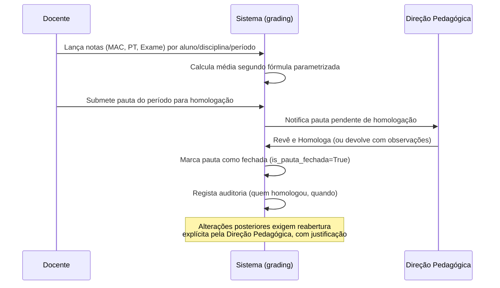
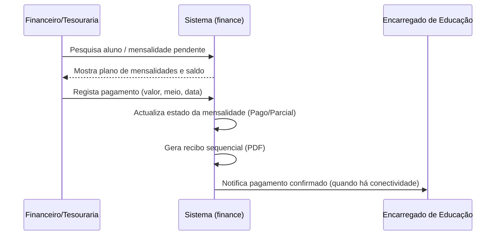
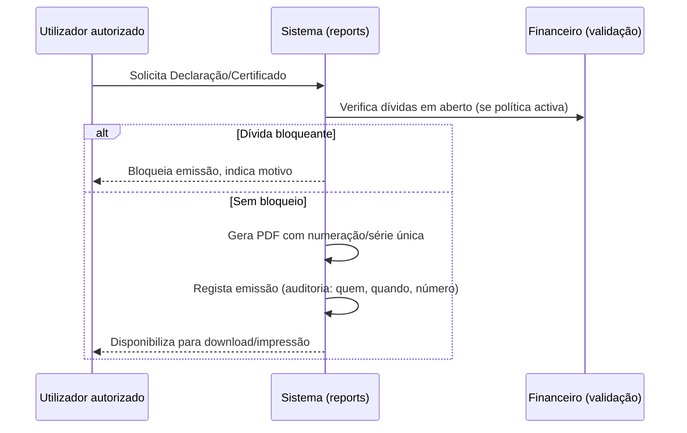

# 07. Perfis, Permissões e Fluxos-Chave

## 7.1 Perfis (Grupos Django)

| Perfil | Âmbito | Descrição |
|---|---|---|
| Super Administrador | Rede (Nó Central) | Gere múltiplas instituições, configurações globais, utilizadores administradores |
| Administrador da Instituição | Instituição | Configura parâmetros locais, gere utilizadores/perfis, vê auditoria e sincronização |
| Direção Pedagógica | Instituição | Homologa pautas, aprova reabertura de notas, supervisiona currículo e frequência |
| Secretaria Escolar | Instituição | Inscrições, matrículas, emissão de documentos, candidatos |
| Financeiro / Tesouraria | Instituição | Tabelas de preços, pagamentos, recibos, relatórios financeiros |
| Recursos Humanos | Instituição | Gestão de funcionários, cargos, contratos |
| Docente | Instituição/Turma | Lançamento de notas e faltas nas suas disciplinas/turmas |
| Director de Turma | Turma | Visão consolidada da turma (notas, faltas), comunicação com encarregados |
| Biblioteca (futuro) | Instituição | Reservado para módulo futuro |
| Encarregado de Educação | Próprios educandos | Portal externo, apenas leitura + pedidos |
| Aluno | Próprios dados | Portal externo, apenas leitura |
| Público | — | Sem autenticação, apenas conteúdos públicos |

## 7.2 Matriz de permissões (resumo por módulo)

Legenda: `C` Criar · `L` Ler · `A` Alterar · `E` Eliminar (sempre soft-delete) ·
`H` Homologar/Aprovar · `—` Sem acesso

| Módulo | Super Admin | Admin Instituição | Direção Pedagógica | Secretaria | Financeiro | RH | Docente | Enc. Educação | Aluno |
|---|---|---|---|---|---|---|---|---|---|
| Instituição/Config. | C L A E | L A | L | — | — | — | — | — | — |
| Currículo (Curso/Disciplina/Turma/Horário) | L | C L A E | C L A | L | — | — | L | — | L (próprio) |
| Inscrição/Matrícula | L | L | L | C L A E | L | — | L (próprios alunos) | L (próprio) | L (próprio) |
| Notas | L | L | L A H | L | — | — | C L A (próprias turmas) | L (próprio educando) | L (próprio) |
| Frequência | L | L | L A | L | — | — | C L A (próprias turmas) | L (próprio educando) | L (próprio) |
| Financeiro | L | L | — | L | C L A E | — | — | L (próprio educando) | L (próprio) |
| RH/Funcionários | L | C L A E | L | — | — | C L A E | L (próprio) | — | — |
| Comunicação | C L A E | C L A E | C L A | C L | — | — | L | L | L |
| Relatórios/Documentos | L | C L A | C L A | C L A | C L (financeiros) | — | L | L (próprio educando) | L (próprio) |
| Auditoria | L | L | — | — | — | — | — | — | — |
| Sincronização | C L A | L | — | — | — | — | — | — | — |

A implementação técnica desta matriz usa **Django Groups + Permissions** como base,
reforçada por **verificações de âmbito ao nível de objeto** (ex.: um docente só vê/edita
notas das turmas às quais está associado via `Horario`; um encarregado só vê os alunos a
que está associado via `EncarregadoAluno`). Recomenda-se `django-guardian` ou lógica de
`QuerySet` filtrada por perfil em cada `service`, evitando dependências externas pesadas
quando um `QuerySet` custom resolve.

## 7.3 Fluxo-chave: Inscrição e Matrícula

Já detalhado em [06-modulos-e-funcionalidades.md §6.4](06-modulos-e-funcionalidades.md).
Pontos de controlo:
- Validação de duplicação por documento de identificação antes da inscrição.
- Validação de vaga disponível antes da matrícula.
- Emissão automática de comprovativo e criação do plano de mensalidades.

## 7.4 Fluxo-chave: Lançamento e Fecho de Pauta

## 7.5 Fluxo-chave: Pagamento de Mensalidade

## 7.6 Fluxo-chave: Sincronização

Ver detalhe técnico completo em
[08-offline-first-e-sincronizacao.md](08-offline-first-e-sincronizacao.md). Resumo do
fluxo do ponto de vista do utilizador/operação:

1. Todas as operações do dia-a-dia gravam localmente e imediatamente (nunca esperam pela
   rede).
2. Um processo em segundo plano no Nó Local tenta sincronizar periodicamente com o Nó
   Central.
3. Quando há conectividade, o Nó Local envia o seu changelog pendente e recebe o
   changelog do Nó Central (e de outros nós, quando aplicável).
4. Conflitos são resolvidos automaticamente quando seguro (ex.: registos distintos) ou
   colocados em fila de resolução manual para o Administrador da Instituição quando
   afectam a mesma entidade (ex.: duas notas diferentes lançadas offline para o mesmo
   aluno/disciplina/período por dois utilizadores).
5. O painel de administração mostra sempre o estado: "Sincronizado há X minutos" /
   "N registos pendentes" / "N conflitos por resolver".

## 7.7 Fluxo-chave: Emissão de Documento Oficial

