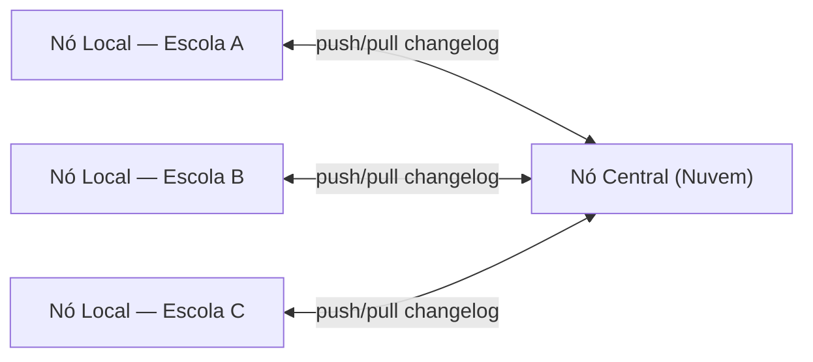
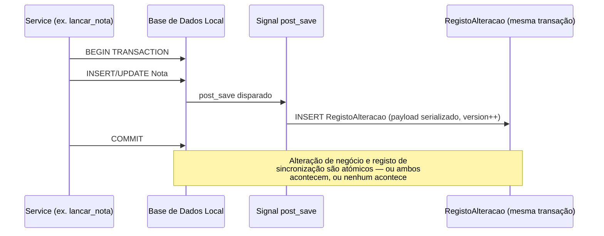
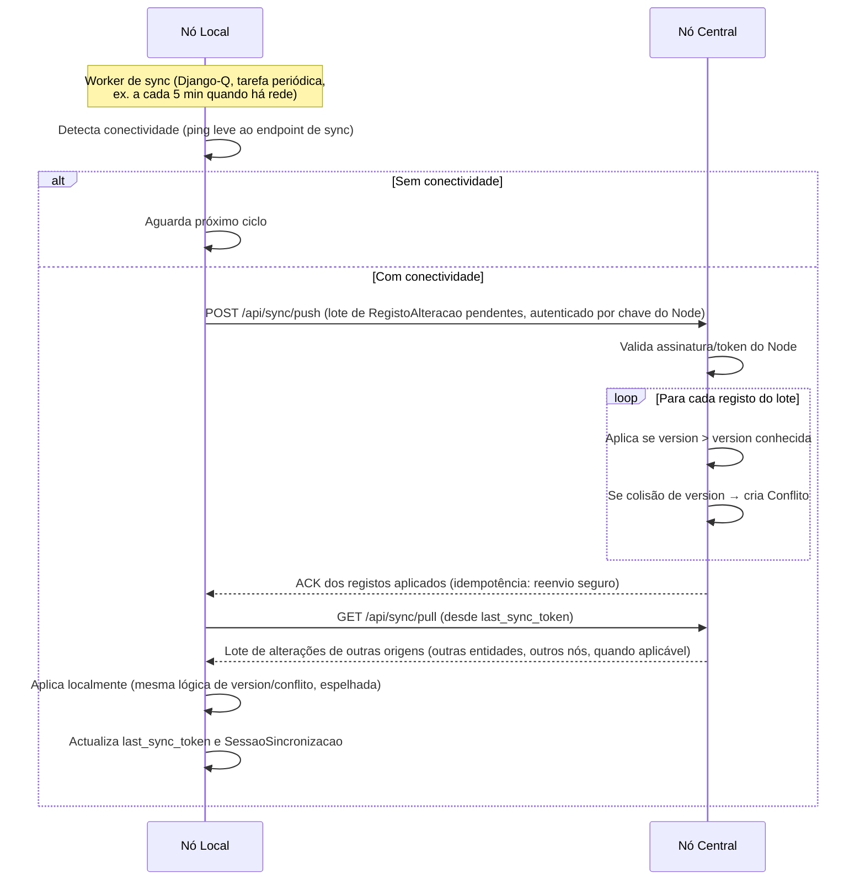

# 08. Offline-First e Sincronização

Este é o requisito estruturante do projeto: **"o sistema deve funcionar tanto offline
como online sem perda de dados, mas com toda a sincronização possível."** Este documento
detalha a estratégia técnica completa.

## 8.1 Princípios

1. **Local-first**: toda escrita acontece primeiro e definitivamente na base de dados
   local do Nó (Local ou Central). A rede nunca está no caminho crítico de uma operação
   do utilizador.
2. **Nunca eliminar, sempre marcar**: soft-delete universal (`is_deleted`) — eliminação
   física apenas por rotina de retenção de dados, nunca como efeito de uma ação de
   utilizador ou de sincronização.
3. **Idempotência**: aplicar o mesmo pacote de sincronização duas vezes não deve produzir
   efeitos duplicados (chaves UUID + números de versão garantem isto).
4. **Sincronização assíncrona e resiliente**: falhas de rede a meio de uma sincronização
   deixam o sistema num estado consistente e retomável, nunca corrompido.
5. **Conflitos são normais, não excepcionais**: o sistema é desenhado para os detectar e
   resolver (automática ou manualmente), não para os evitar a todo o custo.
6. **Transparência operacional**: o estado de sincronização é sempre visível ao
   Administrador da Instituição (painel dedicado).

## 8.2 Topologia

- A sincronização é sempre **Nó Local ↔ Nó Central** (topologia em estrela). Não existe
  sincronização directa Local↔Local — se necessário (ex.: transferência de aluno entre
  escolas da mesma rede), os dados transitam pelo Nó Central.
- Cada Nó Local corresponde normalmente a **uma instituição**. O Nó Central agrega várias.

## 8.3 Modelo de dados de suporte à sincronização

Detalhado em [05-modelo-de-dados.md §5.26](05-modelo-de-dados.md). Resumo do papel de
cada peça:

| Peça | Papel |
|---|---|
| `SyncedModel` (mixin) | Adiciona `id (UUID v7)`, `origin_node_id`, `version`, `is_deleted`, `updated_at`, `updated_by` a toda entidade de negócio |
| `RegistoAlteracao` (outbox/changelog) | Uma linha por cada `create/update/delete` relevante, gravada **na mesma transação** que a alteração de negócio (via Django signal `post_save`/`post_delete`), nunca depois |
| `SessaoSincronizacao` | Regista cada tentativa de sincronização (início, fim, contagens, erros) — permite retomar e auditar |
| `Conflito` | Fila de conflitos detectados, com as duas versões e o estado de resolução |
| `Node` | Identidade de cada nó (chave assimétrica própria, usada para autenticar pedidos de sync) |

## 8.4 Padrão Outbox: como a alteração chega ao changelog

Isto garante que **nunca existe uma alteração local que "esqueça" de ser marcada para
sincronização**, mesmo em caso de falha de energia imediatamente após o commit (o
changelog já está persistido).

## 8.5 Processo de sincronização (push/pull)

Características do protocolo:
- **Lotes paginados** (ex. 200 registos por pedido) para não sobrecarregar ligações
  móveis lentas.
- **`last_sync_token`** (cursor baseado em `criado_em`/sequência do changelog) evita
  reenviar tudo a cada ciclo — só deltas desde a última sincronização bem-sucedida.
- **Compressão** (gzip) do payload HTTP, relevante para custo de dados móveis.
- **Retomável**: se a ligação cair a meio, a próxima tentativa retoma do último lote
  confirmado (o `SessaoSincronizacao` regista o progresso).
- **Autenticação mútua**: cada Nó Local possui uma chave própria (mTLS ou token
  assinado); o Nó Central nunca aceita sync de um nó não registado.

## 8.6 Resolução de conflitos

### 8.6.1 Classificação de conflitos

| Tipo | Exemplo | Estratégia |
|---|---|---|
| **Sem conflito real** | Dois registos diferentes (ex. duas matrículas de alunos distintos) criados offline em nós diferentes | Aplicação directa — UUID garante ausência de colisão |
| **Conflito resolúvel automaticamente** | Mesmo registo, campos diferentes alterados (ex. telefone do encarregado vs. endereço) sem sobreposição de campo | *Merge* campo-a-campo automático |
| **Conflito de concorrência simples** | Mesmo registo, mesmo campo, alterado em dois nós — mas um dos nós é claramente a fonte de verdade da entidade (ex. só a Secretaria da escola de origem pode alterar dados de Aluno) | **Last-Write-Wins** por `updated_at`, com registo do valor descartado em auditoria (nunca perdido, apenas não aplicado) |
| **Conflito crítico** | Notas, Pagamentos, Matrículas alteradas de forma divergente para a mesma entidade | **Fila de resolução manual** — nunca resolvido automaticamente; fica pendente até um Administrador decidir |

### 8.6.2 Por que Notas/Pagamentos/Matrículas exigem resolução manual

Estas entidades têm impacto legal/financeiro directo sobre o aluno. Um "last-write-wins"
silencioso poderia, por exemplo, substituir uma nota correcta por uma errada só porque
foi gravada mais tarde. Por isso, qualquer conflito nestas entidades:
1. É bloqueado de aplicação automática.
2. Gera uma entrada em `Conflito` com as duas versões completas.
3. Aparece no **painel de sincronização** do Administrador da Instituição.
4. Só é resolvido por acção humana explícita (escolher versão A, versão B, ou combinar
   manualmente), com registo de auditoria de quem resolveu e porquê.

### 8.6.3 Interface de resolução

Ecrã dedicado (`admin_panel`) que apresenta lado-a-lado:
- Versão local vs. versão remota (diff destacado).
- Contexto (aluno, disciplina, data, utilizador que originou cada versão).
- Ações: *Aceitar Local*, *Aceitar Remota*, *Editar Manualmente e Guardar*.

## 8.7 Modo de contingência sem qualquer rede (sneakernet)

Para instituições com ausência prolongada de qualquer conectividade (nem móvel, nem
fixa):

1. O Administrador da Instituição gera, no Nó Local, um **pacote de exportação cifrado**
   (`.fsxsync`, contendo o changelog pendente, assinado e cifrado com a chave do Node).
2. O ficheiro é transportado fisicamente (pen-drive) até um local com Internet, ou até à
   sede/nó central.
3. O pacote é importado manualmente no Nó Central através de um ecrã de importação
   dedicado, que aplica exactamente a mesma lógica de validação/conflito do fluxo
   automático (reutiliza o mesmo `service` de aplicação de changelog).
4. O Nó Central pode gerar o pacote inverso (alterações doutras escolas/central
   destinadas a este Node) para o Administrador trazer de volta e importar localmente.

Esta via garante que **nenhuma escola fica permanentemente isolada de dados**, mesmo sem
qualquer forma de rede disponível.

## 8.8 Sincronização nos portais externos (PWA)

Os portais de Aluno e Encarregado (acedidos fora da rede da escola, normalmente via Nó
Central) usam um mecanismo diferente, mais simples, porque não geram dados críticos:

- **Service Worker** com estratégia *stale-while-revalidate* para conteúdo de leitura
  (notas, horário, avisos) — mostra o último dado em cache imediatamente, actualiza em
  segundo plano quando há rede.
- **Background Sync API** para as poucas escritas permitidas a este portal (ex.: pedido
  de justificação de falta, actualização de contacto): o pedido fica em fila no
  navegador (IndexedDB) e é reenviado automaticamente quando a rede volta.
- Indicação visual clara de "dados de [data/hora] — pode não reflectir alterações
  recentes" quando offline.

## 8.9 Garantias contra perda de dados

| Cenário de falha | Garantia |
|---|---|
| Corte de energia a meio de uma gravação | PostgreSQL (WAL) garante que a transação é *tudo ou nada*; nenhuma escrita parcial é visível após reinício |
| Falha de rede a meio do envio de um lote de sync | Lote não confirmado não é marcado como enviado; próxima tentativa reenvia o mesmo lote (idempotente por UUID/version) |
| Encerramento abrupto do servidor local | Serviços (Postgres, Gunicorn) configurados com `restart=always`; base local intacta pelas garantias ACID |
| Dois utilizadores editam o mesmo registo offline em nós diferentes | Detectado como conflito; nunca aplicado silenciosamente se a entidade for crítica (§8.6.2); nunca descartado sem registo |
| Corrupção do disco local | Rotina de backup diário local + cópia para Nó Central quando há rede (ver [11-implantacao-e-operacoes.md](11-implantacao-e-operacoes.md)) |

## 8.10 Estratégia de testes específica de sincronização

Ver também [13-testes-e-qualidade.md](13-testes-e-qualidade.md).

- **Testes de partição de rede simulada**: suite de testes que arranca dois nós Django
  em containers isolados, corta a rede entre eles a meio de uma sincronização, e valida
  que ambos permanecem consistentes e retomam correctamente.
- **Testes de conflito determinístico**: cenários fixos (ex. duas notas diferentes para
  o mesmo aluno/disciplina/período) validando que o conflito é sempre detectado e nunca
  resolvido automaticamente quando a entidade é crítica.
- **Testes de idempotência**: reenvio do mesmo lote de sync duas vezes deve ser
  no-op na segunda vez.
- **Testes de carga de sincronização**: volume realista (uma escola com 3.000 alunos,
  um trimestre inteiro de notas/faltas) sincronizado em condições de rede 3G simulada.

## 8.11 Painel de Estado de Sincronização (Administrador)

Elementos obrigatórios do painel (RF-ADM-04):
- Data/hora da última sincronização bem-sucedida.
- Número de registos pendentes de envio.
- Número de conflitos por resolver (com atalho directo para resolução).
- Histórico das últimas N sessões de sincronização (sucesso/falha, duração, volume).
- Botão de "Sincronizar agora" (forçar tentativa imediata).
- Botão de "Gerar pacote de contingência" (fluxo sneakernet, §8.7).
