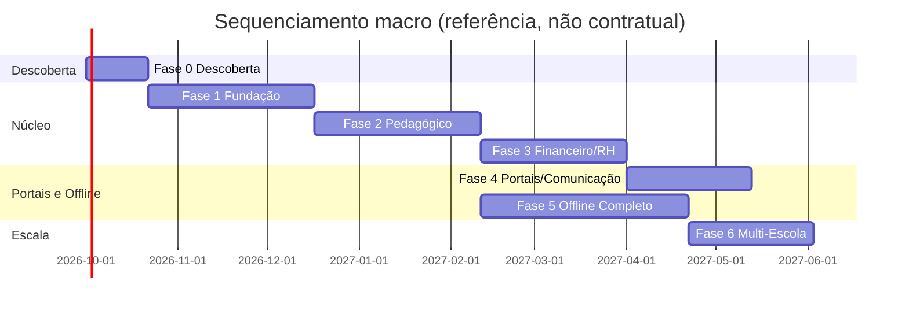

# 12. Plano de Implementação

Roadmap organizado pelos marcos macro definidos em
[01-visao-geral-e-contexto.md §1.9](01-visao-geral-e-contexto.md). Durações são
estimativas de referência (esforço de uma equipa pequena e coesa), não compromissos
contratuais — a validar com escola(s) piloto.

## 12.1 Fase 0 — Descoberta e Validação (2–3 semanas)

- Validação do escopo com pelo menos uma instituição piloto real.
- Confirmação da estrutura curricular exacta praticada (cursos, disciplinas, fórmula de
  média em uso) — a legislação nacional (ver [legislacao/](legislacao/README.md)) dá o
  enquadramento, mas cada escola pode ter particularidades operacionais.
- Levantamento de infraestrutura disponível na escola piloto (energia, rede, hardware
  existente).
- **Entregável**: documento de confirmação de requisitos assinado pela escola piloto.

## 12.2 Fase 1 — MVP / Marco M1 "Fundação" (6–8 semanas)

- App `core`: Instituição, Ano/Período/Ciclo Lectivo.
- App `accounts`: Utilizador, Perfis, onboarding automático de tenant (4.4).
- App `academic` (mínimo): Departamento, Curso, Disciplina, Ano Curricular, Turma.
- App `enrollment`: Inscrição e Matrícula completas (fluxo do documento original).
- App `public_site`: portal público mínimo (apresentação, contactos, comunicados).
- **Critério de aceitação**: uma escola consegue inscrever e matricular alunos reais de
  ponta a ponta, offline, com emissão de comprovativo.

## 12.3 Fase 2 — Marco M2 "Núcleo Pedagógico" (6–8 semanas)

- App `academic`: Horário e Salas, com detecção de conflitos.
- App `grading`: lançamento de notas, cálculo de média parametrizado, fecho de pauta,
  boletins.
- App `attendance`: presenças/faltas, cálculo de assiduidade.
- App `reports` (parcial): pautas e boletins.
- **Critério de aceitação**: um período lectivo completo é gerido (horário → aulas →
  notas → faltas → pauta fechada → boletim emitido) sem sair do sistema.

## 12.4 Fase 3 — Marco M3 "Núcleo Financeiro e RH" (5–7 semanas)

- App `finance`: tabelas de preços, plano de mensalidades automático, pagamentos,
  recibos, extracto financeiro.
- App `hr`: funcionários por secção, cargos, contratos, associação a horário.
- **Critério de aceitação**: matrícula gera automaticamente o plano de mensalidades;
  tesouraria regista pagamentos e emite recibos; RH gere funcionários por secção sem
  intervenção do administrador de topo em cada cadastro.

## 12.5 Fase 4 — Marco M4 "Portais e Comunicação" (4–6 semanas)

- App `student_portal` e `guardian_portal`: consulta de notas, frequência, financeiro.
- App `communications`: avisos, fila de notificações multi-canal.
- PWA (service worker) para leitura offline dos portais externos.
- **Critério de aceitação**: um encarregado de educação acede ao portal fora da escola,
  vê a situação do(s) seu(s) educando(s) e recebe uma notificação de teste.

## 12.6 Fase 5 — Marco M5 "Offline/Online Completo" (6–10 semanas)

- App `sync`: motor completo de changelog/outbox, resolução automática e manual de
  conflitos, painel de estado de sincronização.
- Modo de contingência sneakernet (`.fsxsync`).
- Testes de partição de rede simulada (ver
  [13-testes-e-qualidade.md](13-testes-e-qualidade.md)).
- **Critério de aceitação**: dados criados offline numa escola aparecem correctamente no
  Nó Central após reconexão, sem duplicação nem perda, incluindo cenário de conflito
  forçado resolvido manualmente com sucesso.

## 12.7 Fase 6 — Marco M6 "Rede Multi-Escola" (4–6 semanas)

- Painel de Super Administrador (gestão de múltiplas instituições).
- Relatórios agregados entre instituições da mesma rede.
- Exportações normativas (formato adequado a eventual submissão ao MED).
- **Critério de aceitação**: uma rede de 3+ escolas piloto opera em simultâneo a partir do
  mesmo Nó Central, com isolamento de dados verificado.

## 12.8 Sequenciamento e dependências

Nota: a Fase 5 (motor de sincronização) pode e deve arrancar em paralelo com as Fases
3–4, pois o mixin `SyncedModel` e o padrão outbox (ver
[08-offline-first-e-sincronizacao.md](08-offline-first-e-sincronizacao.md)) devem estar
presentes **desde a Fase 1** em todos os modelos de negócio — o que muda de fase para
fase é a maturidade do motor de resolução de conflitos e do painel de sincronização, não
a captura do changelog em si.

## 12.9 Fora do plano — Fases futuras (pós v1)

- Módulo de Biblioteca.
- Módulo de Cantina/Refeitório.
- Módulo de Transporte Escolar.
- Aplicação móvel nativa (a API DRF de sincronização já preparada facilita esta extensão
  futura).
- Integração directa por API com sistemas do MED, dependente de disponibilidade oficial.
